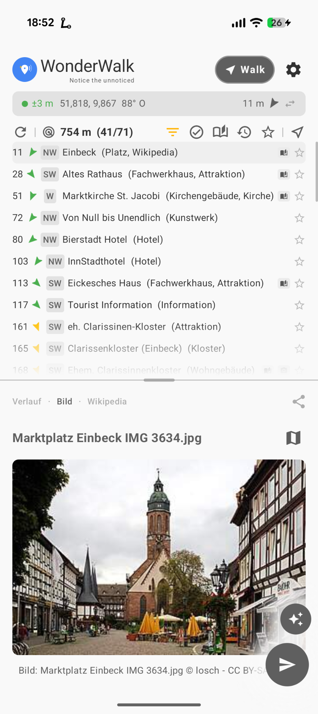
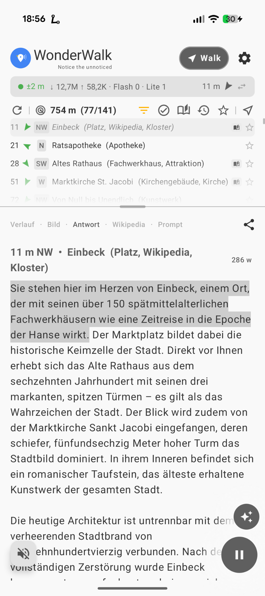
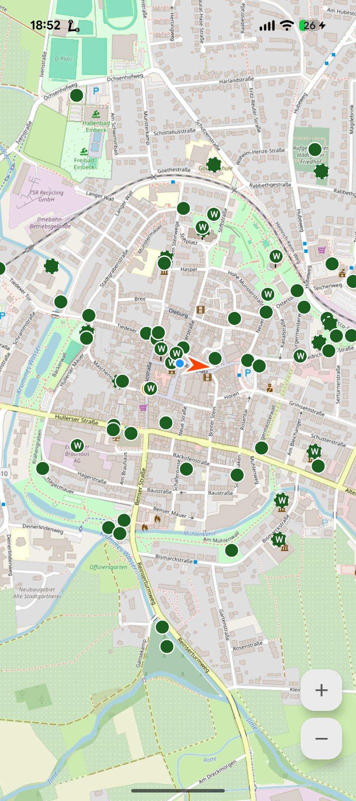
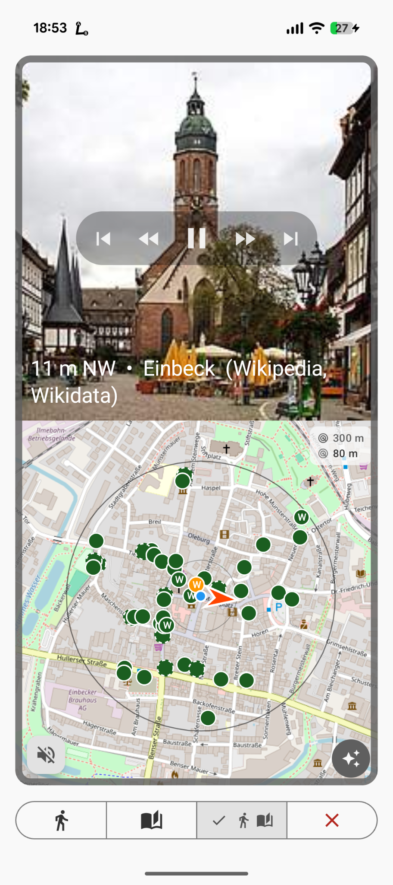
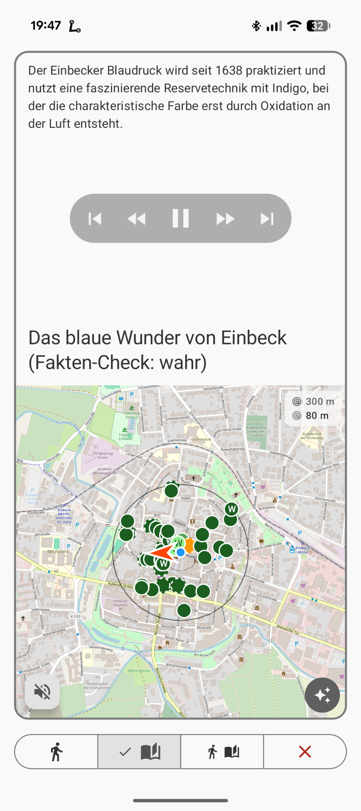
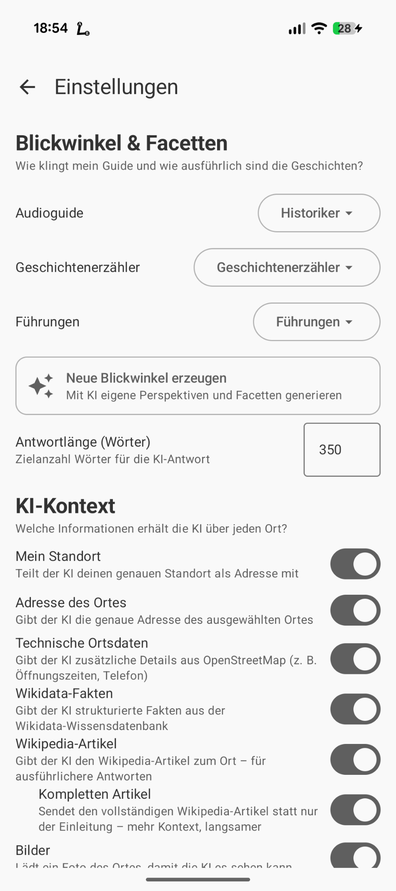

  

<h1 align="center">WonderWalk - Notice the unnoticed</h1>

  <strong>Your personal audio travel guide – powered by AI</strong>

  
  
  
  

---

WonderWalk turns every walk into a journey of discovery. The app automatically recognizes interesting places around you and lets an AI tell you their story – fully automatic if you like, step by step, without ever looking at your phone.

OpenStreetMap, Wikipedia, Wikidata, Wikimedia Commons, OpenHistoricalMap – these open knowledge sources exist side by side, mostly without being connected to one another. WonderWalk brings them together: into a single, complete picture of a place, right on your screen. What you see, where it is, what it means, how the surroundings sound – all in one place. And whatever is still missing, you can contribute yourself: with a photo or an audio recording that instantly becomes part of this shared knowledge.

---

WonderWalk can be used in two completely independent ways:

**As an audio travel guide** – you set off, the app narrates. No need to look at your phone.

**As a Wikimedia contribution tool** – you open the app at home or on the go, see every place around you in a unified list, and immediately spot where photos are still missing. With a few taps you upload an image or sound: the AI writes the description, categories and metadata, links everything to the Wikidata entry – done. No Wikimedia knowledge required, no forms.

**No costs, no subscriptions, no data traps.** All travel and place information comes from open, public sources – OpenStreetMap, Wikipedia, Wikidata. There are no tours to buy, no membership, no hidden use of your personal data. The Google Gemini AI is free for normal usage.

---

## Screenshots

<table width="100%"><tr>
<td width="50%" align="center"> <strong>Manual mode</strong> – POI list with photo, distance and compass direction</td>
<td width="50%" align="center"> <strong>AI answer</strong> – vivid description with Wikipedia context</td>
</tr></table>

<table width="100%"><tr>
<td width="50%" align="center"> <strong>Map view</strong> – all nearby places at a glance</td>
<td width="50%" align="center"> <strong>Walk mode</strong> – POI image on top, map with surroundings below</td>
</tr></table>

<table width="100%"><tr>
<td width="50%" align="center"> <strong>Walk mode stories</strong> – location-based story without a fixed POI</td>
<td width="50%" align="center"> <strong>Settings</strong> – perspective, prompt modes and AI context</td>
</tr></table>

---

## At a glance

| | |
|---|---|
| **Just set off** | Headphones in, tap the hiker icon – WonderWalk speaks automatically as soon as you get close to a place. No need to look at your phone. |
| **Explore on your own** | Browse places near you, tap one, and let the AI narrate – from your perspective, at your own pace. |
| **Stories on the go** | Enable story mode – WonderWalk tells location-based stories without you having to tap a POI. |
| **A photo or a sound, a question** | Tap the camera icon: take a photo and ask the AI, record a sound, or upload a contribution. |
| **Give knowledge back** | Upload photos and audio recordings to Wikimedia Commons – in a few steps, with an AI-generated description and a direct link to the place. |

---

## What WonderWalk can do

### Just set off – auto mode

Enable **auto mode** with the hiker icon at the top, put your phone in your pocket and set off. To start, WonderWalk greets you with a short announcement suited to the time of day. The app monitors your location in the background and announces interesting places near you all by itself – a gentle chime, then a brief note about which compass direction to look, followed by the full AI description.

- Every place is announced **only once**, and never again even after an app restart – but in the auto mode settings you can configure a **revisit delay** and a maximum revisit count, so that after an adjustable pause WonderWalk creates a new AI description and illuminates another aspect of the place
- The service keeps running even when the screen is locked
- **Area announcements**: When you enter a new city, a national park, a biosphere reserve or a geographic region, WonderWalk announces it automatically – with an AI description based on Wikipedia. In the auto mode settings you can control the minimum travel speed at which area announcements are active (walking / cycling / driving / off).
- **Ambient soundscapes**: Each announcement is accompanied by fitting background sounds from Wikimedia Commons – birdsong in the park, church bells at the cathedral, train sounds at the station, flowing water by the river. The AI picks the most fitting category. Sounds are stored locally and are available offline after the first fetch. The sound fades in gently, recedes while speaking, and then slowly fades out. Using the **🚫 icon** in the banner at the bottom left, you can stop a file instantly and block it permanently – it will never be played again. The block list can be viewed and edited in the menu under **Ambient soundscapes**.

### Explore on your own

The app searches within an adjustable radius (50 m to 2 km) for sights, churches, monuments, museums, viewpoints, towers and much more – straight from OpenStreetMap. Each row shows distance, a **colored direction arrow** (green = near, yellow = medium, orange = far) as well as the compass direction as a compact badge.

Tap a place – WonderWalk loads the matching Wikipedia article in the background (preferably in your device language), Wikidata entries and a photo, and passes everything to Google Gemini. The result: a vivid description that goes far beyond what an ordinary travel guide app can offer. Every AI answer can be read aloud to you; playback can be paused and resumed exactly where you left off.

You set the perspective through three independent **prompt modes**: **Audio guide**, **Storyteller** and **Extra info**. In the audio guide there are six ready-made perspectives to choose from – **Historian**, **Architect**, **Naturalist**, **Traveler**, **Family guide** and **City explorer** – each with a different focus on the same place. The storyteller generates place-bound short stories instead of factual descriptions. All modes can be freely customized, or you can create your very own style with a short description – the AI helps you flesh out the template.

Examples:

- "Explain it as if you were an enthusiastic local historian"
- "Focus on architecture and building style, without historical details"
- "Sum it all up in three short sentences for children"
- "Tell myths and legends connected to this place"

Besides current sights, WonderWalk also knows about **vanished places**: demolished buildings, former churches, old factories – stored in OpenHistoricalMap.

### Story mode

Enable **story mode** with the story icon in the top bar. Based on your current location and neighborhood, WonderWalk tells you stories – without you having to tap a specific POI. The AI knows your location and remembers which stories you have already heard, so it doesn't repeat itself.

### A photo, a question

Tap the **camera icon** for a menu with three actions:

- **Take a photo and ask the AI** – See a sign, a facade or a work of art? WonderWalk sends the image together with your location to the AI and delivers context instantly.
- **Record a sound** – Capture the soundscape of a place and upload it directly to Wikimedia Commons (see below).
- **Upload a contribution** – If an image for a place is missing in Wikidata, the option to contribute an existing photo appears here.

### Give knowledge back – contribute to the Wikimedia community

Many places in the world are recorded in OpenStreetMap and Wikidata, but have neither a photo nor an audio recording. WonderWalk points you to them specifically: with the **missing-photo filter** in the POI list, you see at a glance where you can contribute something.

**Share photos:** Tap "Contribute photo" – WonderWalk uploads your image to Wikimedia Commons automatically. The app uses AI to create fitting descriptions, categories and structured metadata, and links the photo directly to the Wikidata entry. No expertise required, no lengthy forms.

**Share sounds:** Record the sound of a place – the carillon, the fountain, the atmosphere of an alley – and upload it in a few steps:

1. Record up to 60 seconds
2. Listen to the recording and re-record if needed
3. The AI analyzes the sound and suggests a file name, description, categories and fitting ambient sound categories (all editable)
4. Post-processing optional: **noise reduction** (spectral subtraction) and **loudness normalization** can be set separately
5. Upload – the file is immediately available on Wikimedia Commons (CC BY-SA 4.0)

Recordings of 30 seconds or more are automatically used by WonderWalk as ambient sound for the respective place. Requires Android 10 or newer.

Whatever you contribute flows straight into the open web of knowledge. WonderWalk uses exactly these recordings itself: as background sound in auto mode when you approach a place. What someone else recorded at a church today, you may hear tomorrow as you walk past.

---

## More features

### Favorites & filters

Mark interesting places with the star icon. Using the icons in the list header, you can narrow the display in a targeted way:

- **Star button** – show favorites only
- **Check button** – hide already visited places
- **Compass button** – direction mode: sort places within the ±45° field of view to the front

All filters are restored automatically when the app restarts.

### History and offline access

All AI answers are **stored locally for 30 days**. In the History tab you can restore earlier answers at any time – even without a network connection, including image and Wikipedia text. Each entry compactly shows: name of the place, time · city · distance.

### Map view

Swipe left in the POI list to see the selected place on an interactive OpenStreetMap map – with your current location and all nearby places. A long press on the map sets a fixed location for preview tours without GPS.

### Multilingual interface

If your device's speech output is set to a language other than German, WonderWalk offers to translate the entire interface via Gemini. Progress is visible live as a bar; the translation is stored locally and automatically extended on updates. The setup screen is already shown in around 70 device languages even before an API key is entered; the rest of the interface can then be translated by the AI into virtually any language.

### RSS export

All saved AI answers can be exported as an RSS feed file. Entries with played ambient soundscapes contain an `<enclosure>` audio file that can be played directly by podcast players (Pocket Casts, Overcast, Apple Podcasts, etc.). Photos appear as a `<media:content>` element.

### Automatic updates

WonderWalk checks at startup whether a new version is available. If so, a note appears in the menu under **Update app**.

---

## Everyday tips

### POI list

| Gesture | What happens |
|-------|-------------|
| Tap a place | Prepare prompt, load image instantly |
| **Long-press** a place | Clear the AI answer and enrichment cache and re-fetch the place |
| Swipe **left** | Map view for this place |
| Swipe **right** | Navigate to the place (OsmAnd) or share the location |
| Tap the **star icon** | Mark / remove favorite |
| **Long-press the star icon** | Reset the announcement – the place is announced again in auto mode |
| **Long-press the header** | Freeze / unfreeze sorting for 60 seconds |
| **Star button** (header) | Show favorites only |
| **Check button** (header) | Hide visited places |
| **Compass button** (header) | Direction mode: places in the ±45° field of view first |
| **Filter icon** (header) | Open search radius and POI types |

### Map

| Gesture | What happens |
|-------|-------------|
| Tap a POI marker | Select the place and close the map |
| **Long-press** the map | Set a fixed location for preview |
| Pinch / two-finger zoom | Zoom the map in / out |
| Android **back button** | Back to the POI list |

### History

| Gesture | What happens |
|-------|-------------|
| Tap an entry | Restore the earlier answer |
| Swipe **left** | Restore the earlier answer without a network |
| Swipe **right** | Set the entry's location as a fixed location (teleport) |
| **Image icon** (header) | Show / hide preview images |
| **Star icon** | Favorite / remove a history entry |

### Result area & tabs

| Gesture | What happens |
|-------|-------------|
| Tap a tab | Switch to that tab |
| Tap the **History** tab or swipe right | Reset POI state (like long-pressing the send button) |
| Swipe horizontally | Switch between tabs (cyclic) |
| Swipe **left** in the **Prompt tab** | Open the prompt in the Gemini app (only if a prompt exists) |
| **Two-finger spread** | Share the POI location; in the image tab with attribution: open the Commons page |
| Drag the **divider** | Adjust the height of the POI list and result area |
| Tap the **POI name** in the answer tab | Open a Google image search for the place |
| Tap the **attribution** text | Open the photo's Wikimedia Commons page |
| Tap the **Street View icon** | Open Google Street View for the POI |
| Tap the **Wikipedia article title** | Open the Wikipedia page in the browser |
| **Share icon** (tab bar) | Share the current AI answer |

### Location and navigation bar

| Gesture | What happens |
|-------|-------------|
| Tap the location row | Add the location text to the prompt |
| **Long-press** the location row | Copy the location text to the clipboard |
| Tap the **direction arrow** | Share the POI location |
| Tap the **compass icon** | Switch between compass and GPS movement heading |
| Tap the **refresh icon** | Reload the POI list |
| **Long-press the refresh icon** | Force-reload the POI list (ignore all caches) |
| Tap the **pinned-location banner** | Clear the fixed location |

### Control bar (top)

| Gesture | What happens |
|-------|-------------|
| Tap the **hiker icon** | Open Walk mode (start auto mode) |
| **Long-press the hiker icon** | Open auto mode settings |
| Tap the **story icon** | Open Walk mode (start story mode) |
| Tap the **settings icon** | Open the settings menu |

### Floating action buttons (FABs)

| Gesture | What happens |
|-------|-------------|
| Tap the **send button** | Send the prompt / start, pause or resume speech |
| **Long-press the send button** | Auto mode: cancel the running announcement; Manual: reset POI state |
| Swipe the **send button up** | Open the current prompt in the Gemini app |
| Tap the **info button** (ⓘ) | Send the Extra info template with POI context to Gemini |
| **Long-press the info button** (ⓘ) | Follow-up question to Gemini using the previous conversation as context |
| Tap the **camera icon** | Menu: take a photo / record a sound / upload a contribution |
| Tap the **ambient soundscape banner** 🚫 | Permanently block the current audio file and stop playback |

### Walk mode

| Gesture | What happens |
|-------|-------------|
| Tap the **POI image** | Pause / resume speech |
| **Long-press the POI image** | Cancel the running announcement |
| Two-finger spread on the **POI image** | Open the attribution (Wikimedia Commons) |
| **Long-press the map** | Open Google Street View at the current POI |
| **✨ button** (map, bottom right) | Send the guide template with the current POI context to Gemini |
| **Walk / Story / Both segment** | Switch mode without leaving Walk mode |
| **Close segment** | Exit Walk mode and stop the service |

### Miscellaneous

| Gesture | What happens |
|-------|-------------|
| Tap the **prompt preview** (bottom) | Open the full prompt editing sheet |

---

## WonderWalk as an interface

WonderWalk does not see itself as a closed solution, but as a **bridge between different worlds**: between map data and AI, between exploration and navigation, between what you see and what lies behind it. Three apps can be opened directly from within WonderWalk:

### Gemini app – for the full AI experience

With a long swipe on the send button, you open the current prompt directly in the **[Google Gemini app](https://play.google.com/store/apps/details?id=com.google.android.apps.bard)** – there you can keep chatting with the AI, ask follow-up questions or dig deeper into the context.

### OsmAnd – navigation with open maps

A long press on a place starts navigation directly in **[OsmAnd](https://osmand.net)** or another installed navigation app – of course Google Maps works too. OsmAnd is free on the [Google Play Store](https://play.google.com/store/apps/details?id=net.osmand) and on [F-Droid](https://f-droid.org/packages/net.osmand.plus/).

### Google Maps – street view right at the place

In the answer tab, tap the **Street View icon** below the attribution, or long-press the map in **Walk mode**: WonderWalk opens **[Google Street View](https://maps.google.com)** directly at the current POI – for a visual impression of the place before you arrive. If Google Maps is not installed, Street View opens in the browser.

---

## Settings & customization

- **Search radius**: 50 m to 2 km, adjustable logarithmically
- **Filter POI types**: show only certain categories; newly discovered types can be disabled automatically
- **Filter presets**: save frequently used filter combinations and let the AI suggest related categories
- **Prompt modes**: three independent templates – Audio guide (POI explanations), Storyteller (location-based stories) and Extra info (follow-up questions via the info button); the AI can refine templates on request
- **Multiple API keys**: store several Gemini keys – on quota errors the app automatically switches to the next key
- **Custom OSM tags**: search for any place types by your own criteria (including regex filters)
- **Region images to the AI**: optionally suppress whether an image is sent to Gemini for area announcements
- **Export/import settings**: back up all settings as a JSON file, ideal when switching devices (requires WonderWalk Pro)

> In landscape orientation, WonderWalk shows a **two-column layout** – the place list on the left, the result area on the right – so both stay visible at once.

---

## Placeholders in prompt templates

In your own prompt templates you can use placeholders of the form `{{NAME}}`, which WonderWalk replaces with current data at runtime. This lets you control which information the AI receives and where it appears in the prompt.

| Placeholder | What gets inserted | Available in |
|---|---|---|
| `{{KONTEXT}}` | User context as XML: date & time, own position (`<my_location>` with address, region, coordinates), POI location (`<poi_location>` with name, type, coordinates, address) and spatial relationship (`<relation>` with distance in meters, compass direction in degrees and as a compass label) | POI mode, camera mode |
| `{{POI}}` | Enriched POI data as XML (`<data>`): OSM tags (`<osm_info>`), OpenHistoricalMap data (`<history_map>`), Wikidata extract incl. P18 image (`<wikidata_extract>`), full Wikipedia article (`<wikipedia_extract>`), image information with source, file name and URL (`<image>`) | POI mode |
| `{{REGION_CONTEXT}}` | City name of the current location per Nominatim geocoding (e.g. `Munich`) | Storyteller |
| `{{LOCATION_CONTEXT}}` | Full address of the current location (e.g. `Marienplatz 1, 80331 Munich`); coordinates as a fallback when no address is available | Storyteller |
| `{{TOLD_STORIES}}` | List of already told stories with title, category and topic ID – so the AI avoids repetition | Storyteller |
| `{{POIS}}` | Short list of the currently visible nearby places (name, type) as a simple bullet list – useful so the AI can relate to neighboring places | Storyteller, POI mode |
| `{{RECENT_ABSTRACTS}}` | Recently fetched Wikipedia summaries as an XML block – helps the AI not to repeat content | POI mode |
| `{{LANG}}` | Language name of the TTS system language in that language (e.g. `Deutsch`, `English`, `Français`) – useful to explicitly instruct the AI to answer in the device language | All modes |
| `{{WORD_COUNT}}` | Target word count for the AI answer as a number (default: 350) – adjustable via the auto mode settings | All modes |

**Notes:**
- Unused placeholders are replaced with an empty string and leave no trace in the finished prompt.
- `{{KONTEXT}}` and `{{POI}}` are the central data carriers in POI mode. If you leave one out, the AI is missing the corresponding information.
- In storyteller mode, `{{KONTEXT}}` and `{{POI}}` are empty – there, `{{REGION_CONTEXT}}` and `{{LOCATION_CONTEXT}}` are the relevant variables.
- The XML structures used in the default templates (e.g. `<instructions>`, `<task>`) are not placeholders, but free formatting aids for the AI – they can be adjusted or omitted at will.

---

## Privacy

- **Location data** does not leave your device – it is processed exclusively locally
- Only **POI information** is transmitted to Google Gemini (name, description, Wikipedia text, image) when you make an AI request
- **API keys** are stored locally on your device – nowhere else
- **No personal data** is stored on external servers

---

## Data sources

WonderWalk would not be possible without these wonderful open projects:

-  – Map data
-  – Historical geodata
-  – Article texts
-  – Structured data
-  – Images and sounds
-  – AI text generation

---

## Getting started

WonderWalk uses the Google Gemini AI. For that you need a **free API key** from Google AI Studio.

1. Visit [aistudio.google.com](https://aistudio.google.com) and sign in with your Google account
2. Create a new API key (free, no credit card required)
3. Open WonderWalk → tap the gear icon at the top right → **API keys**
4. Paste your key and tap **Add**

From now on the AI is ready to go.

---

## WonderWalk Pro & trial

WonderWalk can be tried **free for 7 days** with all features – the trial begins on the first app launch. After that, a **one-time purchase of WonderWalk Pro** unlocks all features permanently: **no subscription, no ads** – pay once, use forever, and support ongoing development. 💚

Alternatively, you can enter an **unlock code**. You'll find both in the menu under **About → WonderWalk Pro**.

- A reinstall grants another 7 trial days – but only Pro keeps all features permanently.
- **Exporting and importing settings** requires Pro (purchase or unlock code) – even during the trial.

---

## Installation

WonderWalk is available on the **[Google Play Store](https://play.google.com/store/apps/details?id=com.panjamo.wonderwalk)** – install it there and you're ready to go.

> **Requirements:** Android 7.0 or newer · GPS · Internet connection
